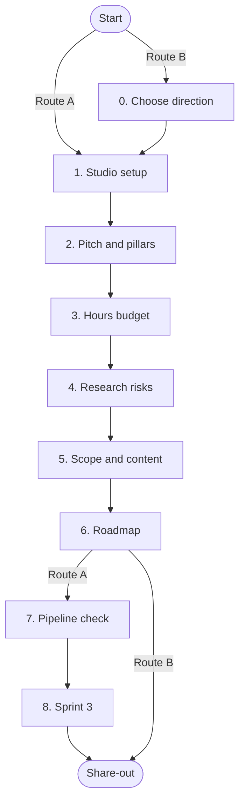

# Game Concept Development — Studio Kick-off

## 1. Overview

From today, treat your team as a **small, new games studio** with one project, a fixed budget of hours, and a release at the end of April 2027. Studios this size rarely fail because the idea was bad. They fail because they **over-scope**, **guess at technical problems instead of researching them**, **spread effort across too many mediocre assets**, or **lose weeks to a broken pipeline**.

You are finishing Sprint 2 of Phase 1. This lab is the meeting a well-run small studio would hold at this point: agree how you work, size the remaining budget, research the risks properly, cut the scope to fewer and better assets, and plan Sprint 3.

Everything you write goes into one file, `docs/studio_plan.md`, in your team repository. It is a living document; revisit it at every sprint review.

Teams take one of two routes today:

- **Route A - your game concept:** work on the concept your team is developing.
- **Route B - a new proposal:** start with Step 0 to choose your direction, either a partner project (Wing Chun or Alzheimer's VR) or a team concept built from your own submissions, then run Steps 1-6 on your choice. Steps 0-6 give you most of the proposal the supervision panel reviews next week; Steps 7 and 8 follow once the proposal is agreed.

### Two rules for this project

1. **Research before you build.** Every technical problem starts with a short, written investigation of how it is solved professionally: official documentation, the engine version you use, a working sample. Guessing, or copying the first tutorial you find, is the main cause of rework in student projects.
2. **Fewer assets, each at your best.** Your game, your portfolio and your grade are judged on the quality of what is on screen and in the speakers, not the quantity. One well-made crate with material variations beats twenty rough crates. Three well-recorded, well-mixed footstep sounds randomised in FMOD beat eight harsh ones.

---

## 2. Learning outcomes

| Outcome | Step |
|:-|:-|
| Assign major and minor roles and agree a working agreement the way a small studio does | 1, Appendix A |
| Turn a concept into a pitch with design pillars and explicit non-goals | 2 |
| Convert team size and weekly hours into a realistic **hours budget** | 3 |
| Research technical risks properly and plan **spikes** to test them | 4 |
| Prioritise features with **MoSCoW** and set a **quality-first content budget** | 5 |
| Map the project calendar's individual and group deliverables onto a roadmap | 6 |
| Set up a GitHub or Diversion, Unreal, Blender and FMOD pipeline a team can share without conflicts | 7, Appendix B |
| Write a Sprint 3 goal and backlog | 8 |

---

## 3. Before You Start

- [ ] Whole team present, one laptop on the team repository, one on shared notes.
- [ ] Your game concept (Route A); or, for Route B, both partner briefs (Sifu Daniel Tyler's "Three Wing Chun Training Projects" and the Nursing brief for Alzheimer's VR) plus your team's submitted concepts and their panel feedback.
- [ ] The CP project calendar, open, with its ICA and GCA deliverables.
- [ ] Create `docs/studio_plan.md` (template in Section 7) and `docs/working_agreement.md` (template in Appendix A).
- [ ] Agree a timekeeper. Every step has a hard time box; move on when it ends.

---

## 4. Plan



| Step | Route A: your game concept | Route B: new proposal |
|:-|:-|:-|
| 0. Choose your direction | - | 10 |
| 1. Studio setup | 6 | 6 |
| 2. Pitch and pillars | 6 | 6 |
| 3. Hours budget | 4 | 4 |
| 4. Research the risks | 10 | 10 |
| 5. Scope and content budget | 10 | 10 |
| 6. Roadmap | 6 | 6 |
| 7. Pipeline check | 5 | - |
| 8. Sprint 3 | 5 | - |
| Share-out | 5 | 5 |
| **Total (minutes)** | **57** | **57** |

---

## 5. Steps

### Step 0 - Choose your direction (Route B, 10 minutes)

You will bring one new proposal to the supervision panel next week. It can take either of two forms. Look at both, then commit to one before you leave today.

**Option 1 - A partner project.** Build a game with an external partner:

| | Wing Chun (Sifu Daniel Tyler) | Alzheimer's VR (Nursing) |
|:-|:-|:-|
| Formats on offer | **Lineage** (story-driven PC action game), **Shadow Sifu** (phone AR), **The Kwoon** (VR training hall) | VR teaching game |
| Partner input | Visits to demonstrate techniques and review work; Yip Man Wing Chun only | Nursing staff; subject matter and access to users to be confirmed |
| First question to resolve | Which of the three projects, and which slice of the curriculum the game teaches | **Who is the player?** Nursing students or carers learning about dementia, or people living with dementia. These are different games with different ethics requirements |
| Hardware | Lineage: PC. Shadow Sifu: AR-capable phones. The Kwoon: Quest 3 | Quest 3 |

**Option 2 - A team concept.** Build a stronger concept from your own submissions, in one of two ways:

- **Combine** two or more members' concepts. Build around **one** core loop: take the strongest mechanic from one concept and, where it fits, the setting, theme expression or a supporting system from another. A combination that keeps every feature of every concept will not fit the hours budget.
- **Re-scope** one member's concept. Keep its core idea and cut it down to what this team can build well, fixing the issues raised in the panel feedback.

For Option 2, the concept must still use one of this year's themes (Borrowed Time or Thin Places). Bring the panel feedback on the source concepts to the table, and show in the proposal how each point has been addressed: prior art, scope, theme in the mechanics, or a vague slice. Once chosen, the concept belongs to the whole team, whoever first submitted it.

**Deciding.** List every candidate (each partner format you would consider, and each combination or re-scoped concept), then score each 1-5 on: team interest, skills match, how well it answers the panel feedback or partner brief, hardware and partner access, and how clearly you can describe the first 10 minutes of play. Pick the highest total; break ties on team interest.

**Checkpoint:** one direction chosen with a one-line reason. For a partner project, the first question for the partner. For a team concept, the source concepts it draws on and the panel feedback it must answer.

### Step 1 - Studio setup (6 minutes)

Small studios run on clear ownership. Every area has **one owner** who makes the final call after discussion; everyone else contributes to it. Each of you holds a **major** role (most of your hours) and a **minor** role (a smaller, regular share). A team of four or five has eight to ten role slots, so fill every core role first, then add the specialist roles your game actually needs.

**Core roles: every team fills all six.**

| Role | Owns |
|:-|:-|
| Producer / Scrum Master | Backlog, sprint ceremonies, the hours budget, the calendar's ICA and GCA deliverables, partner and supervisor contact |
| Technical lead | Unreal project settings, version control rules, builds, code and Blueprint review, the research cards |
| Design lead | Pillars, core loop, balancing, the scope cut list |
| Art lead | Art direction, Blender pipeline, naming, the art quality bar and asset reviews |
| Audio lead | FMOD project, sound and music list, the audio quality bar and mix |
| QA and playtest lead | Test plan, bug tracking and triage, playtest sessions with people outside the team, build sign-off at each milestone |

**Specialist roles: take on only those your game needs.**

| Role | Owns | Typical in |
|:-|:-|:-|
| Gameplay programmer | Player controller, core mechanics, game state | Every game; often the technical lead's major |
| AI programmer | Enemy and NPC behaviour (Behaviour Trees or StateTree, perception, schedules) | Stealth, combat, simulation |
| Technical artist | Materials, lighting, VFX (Niagara), performance budgets, the bridge between art and code | Stylised or VR games; anything with a strong visual effect |
| Animator | Rigging, animation sets, retargeting, Animation Blueprints | Character-led games, combat |
| Level designer | Layouts, pacing, grey-boxing, encounter placement | Exploration, puzzle, stealth |
| Narrative designer / writer | Story, dialogue, branching structure, in-game text | Narrative and choice-led games |
| UX / UI designer | Menus, HUD, onboarding and tutorials, accessibility options, usability testing | Every game; essential in VR, AR and teaching games |
| Documentation lead | Structure and consistency of the project documentation and repository README; checks that every member's documentation is current at each milestone | Every team; usually a minor role |
| Partner liaison | Partner meetings, questions and feedback, representing the partner's subject accurately | Partner projects (Wing Chun, Nursing); otherwise held by the producer |

Rules for assigning roles:

- **Every core role has exactly one owner.** No core role is shared or left empty.
- **Avoid overloaded pairings.** The producer should not also be the technical lead, and the QA lead should not be the only tester of their own work.
- **Documentation is everyone's job.** Each member documents their own work; the documentation lead owns the structure, not the content.
- **Write down specialist roles you are not filling, and why** (for example, "No narrative designer: the game has no dialogue"). If a specialist area matters to your game and nobody owns it, add it as someone's minor role.

Record each member's major and minor role in `studio_plan.md`. Then create `docs/working_agreement.md` from the template in **Appendix A** and answer the questions in it. Answer the starred questions today; finish the rest before the end of Sprint 3.

**Checkpoint:** all six core roles have one owner each; every member has a major and a minor role; unfilled specialist roles are listed with a reason; starred working-agreement questions answered.

### Step 2 - Pitch, pillars and non-goals (6 minutes)

Write:

1. **The pitch**, one sentence: "It's a <genre> where you <core verb> to <goal>, set in <world>."
2. **Three design pillars**: short phrases every feature must serve. Example for a Wing Chun game: "Win by reading, not mashing"; "Every technique has a reason"; "Honest feedback". See **Appendix C** for pillars from published games and a test for good pillars.
3. **The player and platform**: who plays, on what, for how long per session.
4. **Non-goals**: three things this game will deliberately **not** do (for example: no multiplayer, no open world, no full voice acting). Studios write these down because they are the first things teams drift into.

**Checkpoint:** read the pitch aloud; anyone outside the team should be able to repeat it back.

### Step 3 - Budget the hours (4 minutes)

Hours are your scarcest resource. From now to the end of April is about 20 weeks at 8 hours per person per week.

| Line | Formula | 4 people | 5 people |
|:-|:-|:-|:-|
| Gross hours | people x 8 h x 20 weeks | 640 | 800 |
| Overhead (Scrum ceremonies, documentation, ICA work, partner meetings): about 25% | gross x 0.25 | 160 | 200 |
| Buffer for illness, other deadlines and surprises: about 20% of the rest | (gross - overhead) x 0.2 | 96 | 120 |
| **Production hours** | what remains | **384** | **480** |

Every estimate from now on is checked against this figure. As a rough guide, one polished level with a few minutes of play can absorb 150-250 production hours on its own.

**Checkpoint:** one production-hours figure, agreed by the whole team.

### Step 4 - Research the risks (10 minutes)

Small studios kill their biggest risk first, and they **research before they build**. List everything that could stop the game shipping, then pick the **three** most dangerous. Typical categories:

- **Technical**: a system nobody on the team has built (VR hand tracking, AR placement, combat AI, saving branching state, procedural rooms).
- **Design**: the core loop might not be fun.
- **Content**: more characters, animations, levels or sounds than the hours allow.
- **Partner**: expectations, availability, or approval of how their subject is represented.
- **Hardware**: devices you need but do not have enough of.

For each technical risk, fill in a **research card** before anyone writes code:

| Field | What good looks like |
|:-|:-|
| Question | One precise question: "How do we detect a Pak Sao block from Quest 3 hand tracking in UE5?" |
| Engine version | The exact version the team uses; check every source matches it or note the difference |
| Primary sources | Official documentation (Epic, Meta, FMOD, Blender), engine source or sample projects. At least two |
| Secondary sources | Talks, papers, postmortems, forum threads; note the date, because Unreal answers older than your engine version are often wrong |
| Options found | Two or three ways to solve it, with the trade-off of each |
| Recommendation | The option you will spike, and why |
| Spike | A time-boxed experiment (one to five days of effort) with a pass or fail test |

Today, write the question, name the owner and list the first two primary sources to read. The owner completes the card in Sprint 3, and the team reviews it before any production code is written on that system.

What does **not** count as research: the first tutorial video you find, a forum answer with no engine version, or an answer from a chatbot you have not checked against the documentation.

**Checkpoint:** three risks; each technical risk has a research card with its question, owner and first two primary sources; every spike fits in Sprints 3-4.

### Step 5 - Scope and content budget (10 minutes)

**Features.** List every feature, then sort them:

| Bucket | Meaning | Rule of thumb |
|:-|:-|:-|
| **Must** | The game does not work without it | About 60% of production hours |
| **Should** | Important, but the game still works without it | About 20% |
| **Could** | Only if ahead of schedule | About 20% |
| **Won't (this release)** | Agreed out of scope | Write these down; it stops arguments later |

Estimate each Must and Should in hours. If the Musts exceed about 60% of production hours, cut or simplify until they do not. Then define your **vertical slice**: the smallest playable piece that contains the core loop at near-final quality.

**Content budget: fewer assets, each at your best.** Professional teams cap asset counts and set a quality bar, then spend the saved time making each asset good. Fill in this table with **maximum** counts:

| Asset type | Max count | How variety is achieved without new assets | Quality bar (who signs it off) |
|:-|:-|:-|:-|
| Hero assets (player, key characters, signature props) | | | |
| Environment kit (modular walls, floors, props) | | Modular pieces, material instances, decals, lighting | |
| Props | | One mesh, several material instances; scale and rotation | |
| Animations | | Blend spaces, montages, retargeting | |
| Sound effects | | FMOD multi-instruments with pitch and volume randomisation | |
| Music cues | | Layered or adaptive stems in FMOD | |
| UI screens | | One widget style reused | |

Rules for the content budget:

- **Variation comes from parameters, not new files.** A crate has one mesh and three material instances (wood, painted, burnt), not twenty meshes. A footstep is three good recordings in one FMOD multi-instrument with small pitch and volume randomisation, not eight rough files.
- **An asset is done only when it meets the quality bar**: named to the convention (Appendix B), correct scale, clean topology and UVs, textures sized sensibly, collision set, sound levels balanced in FMOD, and reviewed in engine by its lead. "Imported" is not done.
- **Build hero assets first, at final quality,** for the vertical slice. Placeholder grey boxes are fine everywhere else until the slice is signed off.
- **Count, then cut.** If the Must list needs more assets than the hours allow, reduce the count; do not lower the quality bar.

**Checkpoint:** Musts fit inside 60% of production hours; vertical slice described in three sentences or fewer; content budget filled in with maximum counts and a named reviewer for each row.

### Step 6 - Roadmap (6 minutes)

Lay out the rest of the year in two-week sprints, using the **CP project calendar**. Copy every **ICA** (individual) and **GCA** (group) deliverable into the table with its week and date, then work backwards: each deliverable needs the work behind it finished at least one sprint earlier.

| Phase | Sprints | Weeks and dates | Calendar deliverables (ICA / GCA) | Team goal | Exit test |
|:-|:-|:-|:-|:-|:-|
| Phase 1 (ending) | S1-S2 | | | Concept agreed; team formed; pipeline set up | Studio plan committed |
| CALENDAR_PHASE | S3-S4 | | | Research cards complete; spikes done; grey-box core loop | Core loop playable with grey boxes; team agrees it is worth building |
| CALENDAR_PHASE | | | | Vertical slice | Slice playable at near-final quality in a packaged build |
| CALENDAR_PHASE | | | | **Alpha**: every Must feature in; placeholders allowed | Feature complete; no new features after this |
| CALENDAR_PHASE | | | | **Beta**: all content in at the quality bar; bug fixing and tuning | No known crashes; playtested by people outside the team |
| CALENDAR_PHASE | | | | **Release candidate** | Packaged, tested build delivered; post-mortem written |

Two checks before you move on:

- **ICA deliverables are individual.** Each team member's ICA work must be visible in the backlog and the hours budget, not done on top of it.
- **GCA deliverables are milestones.** Put each GCA date on the board as a milestone, and plan the sprint before it to finish early, not on the day.

**Checkpoint:** every calendar deliverable appears in the table; every phase has an exit test; no deliverable falls in a sprint with no work planned for it.

### Step 7 - Pipeline check (5 minutes; Route A)

Most lost weeks in student and indie teams come from the pipeline, not the game. The technical lead reads this list aloud; tick what is done and put the rest on the Sprint 3 backlog.

**Version control: GitHub**
- [ ] **Git LFS** tracks `.uasset`, `.umap`, `.fbx`, `.blend`, `.wav` and FMOD bank files.
- [ ] Unreal `.gitignore` in place (`Binaries/`, `Intermediate/`, `Saved/`, `DerivedDataCache/`).
- [ ] **File locking** on binary assets (`git lfs lock`). Binary files cannot be merged: if two people edit the same map or Blueprint, one person's work is lost.
- [ ] `main` is protected; work happens on short-lived branches merged by pull request with one reviewer.

**Version control: Diversion**
- [ ] Diversion's Unreal Editor plugin is installed and selected as the revision control provider for every team member.
- [ ] **Exclusive locks** are used on maps and Blueprints before editing; conflict warnings are never dismissed without checking with the teammate named.
- [ ] Branching and review rules are written in the working agreement, because Diversion does not enforce them for you.

**Both**
- [ ] One Scrum board (for example GitHub Projects) holds the backlog; every task links to its commit or pull request.

**Unreal Engine**
- [ ] Every team member uses the **same engine version**, written in the README.
- [ ] Folder structure and asset naming follow **Appendix B** from the first asset.
- [ ] Large levels use **One File Per Actor** (World Partition) so several people can work in one map without locking each other out.
- [ ] A packaged build is made at the end of **every** sprint, not only before deadlines.

**Blender**
- [ ] Units and scale agreed (Unreal uses centimetres), forward axis and export settings written down.
- [ ] Source `.blend` files kept in the repository beside exported `.fbx` files.

**FMOD Studio**
- [ ] FMOD project lives in the repository; **one owner** edits it at a time.
- [ ] Banks are rebuilt and committed when audio changes; event paths follow the naming in Appendix B.

**Checkpoint:** every unticked item is a task on the Sprint 3 backlog with an owner.

### Step 8 - Sprint 3 (5 minutes; Route A)

Write one **sprint goal** (one sentence a stakeholder would understand) and 8-15 backlog items that deliver it. Most Sprint 3 items are the research cards and spikes from Step 4, the hero assets for the vertical slice, and the pipeline tasks from Step 7. Every item has an owner and an estimate; the total fits the team's hours for two weeks.

**Checkpoint:** sprint goal written; backlog on the board; total estimate within two weeks of team hours.

### Share-out (5 minutes, whole class)

Each team, in 60 seconds: the pitch, the biggest technical risk and the two sources you will read first, and one asset type you capped today. Route B teams also say which direction they chose and why.

---

## 6. Debugging and Pitfalls

| Pitfall | What it looks like | What a small studio does instead |
|:-|:-|:-|
| Building before researching | A system rebuilt twice because the first approach did not suit the engine version | Research card first; review it as a team before production code |
| Outdated answers | Following a 2019 forum fix in UE5 | Check every source against your engine version; prefer official docs and samples |
| Quantity over quality | 20 crate variants, 8 harsh footsteps, none finished | Cap counts; vary with material instances and FMOD randomisation; finish fewer assets to the quality bar |
| Scope creep | "While we're at it, let's add..." | New ideas go to Could or Won't until Alpha; the design lead owns the cut list |
| Late risk | The hardest system is scheduled for March | Spike it in Sprint 3 or 4; change the design if the spike fails |
| Art before fun | Polished assets for a loop nobody has played | Grey-box until the core loop is fun; build final art for the vertical slice first |
| Lost work on binary files | Two people saved the same map | Lock binary assets; use One File Per Actor; check before editing shared maps |
| "It works on my machine" | Builds fail at the deadline | Package a build every sprint; one engine version for everyone |
| Calendar surprise | An ICA or GCA deadline lands in a sprint with no time planned | Every calendar deliverable is on the board and in the hours budget |
| Hero developer | One person works 30 hours a week to rescue the build | Plan to the hours budget; a busy week means cutting scope, not working nights |

---

## 7. Production Checklist: `docs/studio_plan.md` template

```markdown
# Studio Plan - TEAM_NAME

## Direction (Route B only)
Option: partner project / team concept (combined or re-scoped).
Candidates and scores; reason for the choice.
Partner project: first question for the partner.
Team concept: source concepts used; each panel feedback point and how it is addressed.

## Studio
| Member | Major role | Minor role |
|:-|:-|:-|
| | | |

Core roles (one owner each): Producer / Scrum Master; Technical lead; Design lead; Art lead; Audio lead; QA and playtest lead.
Specialist roles not filled, and why:

Working agreement: see `docs/working_agreement.md` (Appendix A template; starred questions today, the rest by the end of Sprint 3).

## Pitch
One-sentence pitch:
Pillars: 1. / 2. / 3.
Player, platform, session length:
Non-goals: 1. / 2. / 3.

## Hours budget
Team size: | Gross: | Overhead: | Buffer: | Production hours:

## Top three risks
| Risk | Type | Owner | Spike sprint |
|:-|:-|:-|:-|

## Research cards (one per technical risk)
Question:
Engine version:
Primary sources (2+):
Secondary sources (with dates):
Options found and trade-offs:
Recommendation:
Spike and pass/fail test:

## Scope
| Item | MoSCoW | Estimate (h) |
|:-|:-|:-|
Must total (h): ___ of ___ production hours (target 60% or less)
Vertical slice:

## Content budget
| Asset type | Max count | Variety from | Quality bar / reviewer |
|:-|:-|:-|:-|

## Roadmap
| Phase | Sprints | Weeks and dates | Calendar deliverables (ICA / GCA) | Team goal | Exit test |
|:-|:-|:-|:-|:-|:-|

## Pipeline
Version control: GitHub / Diversion
Unticked items moved to Sprint 3:

## Sprint 3
Sprint goal:
Backlog: linked on the Scrum board.
```

---

## 8. Extension

- Complete one research card in full now, with sources read and options compared.
- Make one hero asset's quality checklist (Step 5) concrete for your game: polygon range, texture sizes, material instance parameters, sound loudness target.
- Write a one-paragraph **partner or panel update** (Route B) or **stakeholder update** (Route A) as if sending it to a publisher: what you are making, the vertical slice, and what you need from them.

---

## 9. Reflective Questions

1. Which technical risk did your team most want to start building straight away, and what would the research card have to show before that is sensible?
2. Which asset type did you cap hardest, and how will the game still feel varied?
3. If your production hours were cut by a quarter tomorrow, what would you cut first, and does the vertical slice still work?
4. Which calendar deliverable is most likely to collide with game work, and what have you planned to stop that?

---

## 10. How This Builds

This plan is the baseline for every sprint review: the hours budget tracks actual against estimated effort, the research cards and spikes drive Sprints 3 and 4, the content budget sets the quality bar for every asset review, and the roadmap's exit tests become the criteria at each calendar deliverable. Route B teams turn Steps 0-6 into next week's proposal.

---

## Appendix A - Working Agreement Questions

Answer as a team and record the answers in `docs/working_agreement.md`, using the template at the end of this appendix. Starred questions (*) are answered in this lab; the rest by the end of Sprint 3. Review the agreement at every sprint retrospective.

**Availability and communication**

1. \* What are our core hours, when everyone can be reached and is expected to respond?
2. \* Which single channel do we use for team communication, and what never goes there (for example, decisions that belong on the board)?
3. \* How quickly do we reply to a message during the week, and at weekends?
4. How do we tell the team we are ill, overloaded or going to miss a commitment, and how early?
5. Which days and times are our Scrum ceremonies (planning, stand-up, review, retrospective), and are they in person or online?

**Decisions and disagreement**

6. \* How are decisions made: by the area owner after discussion, by vote, or by consensus? Which decisions need the whole team?
7. \* What happens when two people disagree and the owner's decision does not settle it?
8. Where are decisions recorded so nobody relitigates them later?
9. Who speaks to the supervisor and the partner, and how is that reported back to the team?

**Quality and done**

10. \* What is our **definition of done** for a task: merged, builds without errors, tested in a packaged build, closed on the board?
11. \* What is our definition of done for an asset (Step 5 quality bar), and who reviews each asset type?
12. Who reviews code and Blueprints, and how fast must a review happen?
13. What do we do when something merged to `main` breaks the build?

**Version control and files**

14. \* GitHub or Diversion, and what are our rules for branches, locks and merges?
15. Who may edit shared maps, the FMOD project and core Blueprints, and how do we claim them?
16. What is our naming and folder convention (Appendix B), and who checks it?

**Workload and fairness**

17. How do we track hours against the budget (Step 3), and how often do we check them?
18. What do we do if one member is consistently over or under their hours?
19. How do we make sure every member's ICA work is planned and visible, not done in secret at the last minute?
20. How will every member's contribution be visible in the repository and on the board at the end of the project?

**Research and tools**

21. Where do research cards live, and who reviews them before production work starts?
22. What is our policy on tutorials, marketplace assets and generative tools: what is allowed, and how is it declared?

**Wellbeing and escalation**

23. How do we raise a problem with a teammate, and at what point do we involve the supervisor?
24. What will we do in the week before a GCA deadline to avoid all-nighters?

### Template: `docs/working_agreement.md`

Copy this into `docs/working_agreement.md`. Replace every prompt in angle brackets; keep answers short and specific enough that someone could check whether the team is keeping to them.

```markdown
# Working Agreement - TEAM_NAME

Version: 1.0 | Agreed: DATE | Next review: Sprint RETRO_NUMBER retrospective

## 1. Availability and communication

| Item | Our agreement |
|:-|:-|
| Core hours (*) | <days and times everyone is reachable> |
| Team channel (*) | <one channel>; not used for: <for example, decisions that belong on the board> |
| Reply time (*) | Weekdays: <hours>. Weekends: <hours, or "not expected"> |
| Absence and overload | Tell the team via <channel> at least <time> before a missed commitment |
| Scrum ceremonies | Planning: <day, time, place>. Stand-up: <days, time, format>. Review and retrospective: <day, time> |

## 2. Decisions and disagreement

| Item | Our agreement |
|:-|:-|
| How decisions are made (*) | <owner decides after discussion / vote / consensus> |
| Whole-team decisions | <for example: changing pillars, cutting a Must, changing engine version> |
| Unresolved disagreement (*) | <for example: one more discussion, then the producer decides; supervisor if still stuck> |
| Where decisions are recorded | <for example: docs/decisions.md, newest first> |
| Supervisor and partner contact | <who speaks for the team, and how it is reported back> |

## 3. Quality and done

| Item | Our agreement |
|:-|:-|
| Definition of done: tasks (*) | <for example: merged; builds without errors; tested in a packaged build; closed on the board> |
| Definition of done: assets (*) | <quality bar from Step 5>; reviewed by <role> for each asset type |
| Code and Blueprint review | Reviewed by <role>, within <time> |
| Broken build on main | <for example: whoever broke it fixes or reverts within 24 hours; nobody merges until fixed> |

## 4. Version control and files

| Item | Our agreement |
|:-|:-|
| Tool (*) | GitHub / Diversion |
| Branches and merges (*) | <branch naming; review rule; who merges> |
| Locking (*) | <files that must be locked before editing; how to release a lock> |
| Shared files | Maps: <rule>. FMOD project owner: <name>. Core Blueprints: <rule> |
| Naming and folders | Appendix B conventions; checked by <role> at <when> |

## 5. Workload and fairness

| Item | Our agreement |
|:-|:-|
| Hours tracking | <tool>; checked against the budget at <every stand-up / sprint review> |
| Imbalance | <what happens if someone is consistently over or under their hours> |
| Individual (ICA) work | <how each member's ICA work appears on the board and in the hours budget> |
| Visible contribution | <how each member's work shows in commits, tasks and documentation> |

## 6. Research and tools

| Item | Our agreement |
|:-|:-|
| Research cards | Stored in <location>; reviewed by <role> before production work starts |
| Tutorials, marketplace assets, generative tools | Allowed: <list>. Not allowed: <list>. Declared in: <location> |

## 7. Wellbeing and escalation

| Item | Our agreement |
|:-|:-|
| Raising a problem with a teammate | <first step; second step> |
| When we involve the supervisor | <trigger, for example: same issue raised twice without change> |
| Before a GCA deadline | <for example: feature freeze <n> days before; no all-nighters> |

## 8. Roles

| Member | Major role | Minor role |
|:-|:-|:-|
| | | |

## 9. Sign-off

Each member confirms they have read and agree to this version.

| Member | Agreed (date) |
|:-|:-|
| | |

## 10. Change log

| Date | Change | Agreed at |
|:-|:-|:-|
| | | |
```

---

## Appendix B - Unreal Asset Naming Conventions

Follow Epic's recommended pattern from the first asset. Consistent names make assets searchable, reviewable and safe to reference from Blueprints and C++.

### Pattern

```
[AssetTypePrefix]_[AssetName]_[Descriptor]_[OptionalVariantLetterOrNumber]
```

Examples: `SM_Crate_Wood`, `MI_Crate_Burnt`, `T_Crate_Wood_N`, `BP_Door_Locked`, `AS_Player_Run_Fwd`, `SM_Wall_Stone_A`.

Rules:

- **PascalCase** inside each part; underscores only between parts; no spaces, no special characters.
- **English, descriptive names**: `SM_Bookshelf_Tall`, not `SM_Thing2` or `SM_Final_v3_REAL`.
- **Variants use a letter or number at the end** (`_A`, `_B`, `_01`), and only when the mesh is genuinely different. Colour and wear variants are **material instances**, not new meshes.
- **Never put version numbers in asset names.** Version control holds the history.

### Asset type prefixes (Epic recommended)

| Asset type | Prefix | Asset type | Prefix |
|:-|:-|:-|:-|
| Static Mesh | `SM_` | Blueprint | `BP_` |
| Skeletal Mesh | `SK_` | Blueprint Interface | `BI_` |
| Skeleton | `SKEL_` | Actor Component | `AC_` |
| Physics Asset | `PHYS_` | Widget Blueprint | `WBP_` |
| Physics Material | `PM_` | Animation Blueprint | `ABP_` |
| Material | `M_` | Animation Sequence | `AS_` |
| Material Instance | `MI_` | Animation Montage | `AM_` |
| Post Process Material | `PPM_` | Blend Space | `BS_` |
| Texture | `T_` | Rig | `Rig_` |
| HDRI | `HDR_` | Level Sequence | `LS_` |
| Niagara System | `FXS_` | Data Table | `DT_` |
| Niagara Emitter | `FXE_` | Curve Table | `CT_` |
| Niagara Function | `FXF_` | Enum | `E_` |
| | | Structure | `F_` |

### Team additions (common practice, not in Epic's list)

Agree these in the working agreement if you use them.

| Asset type | Prefix | Asset type | Prefix |
|:-|:-|:-|:-|
| Material Function | `MF_` | Behaviour Tree | `BT_` |
| Material Parameter Collection | `MPC_` | Blackboard | `BB_` |
| Render Target | `RT_` | Input Action | `IA_` |
| Data Asset | `DA_` | Input Mapping Context | `IMC_` |
| Level (map) | `L_` | Control Rig | `CR_` |

### Texture suffixes (team convention)

| Map | Suffix |
|:-|:-|
| Base colour (albedo) | `_D` |
| Normal | `_N` |
| Packed occlusion, roughness, metallic | `_ORM` |
| Roughness / metallic / ambient occlusion (unpacked) | `_R` / `_M` / `_AO` |
| Emissive | `_E` |
| Opacity mask | `_Mask` |

Example: `T_Crate_Wood_D`, `T_Crate_Wood_N`, `T_Crate_Wood_ORM`.

### Folder structure

```
Content/
  GAME_NAME/
    Core/          game mode, player controller, shared Blueprints
    Characters/    one folder per character: meshes, animations, materials
    Environment/   kits by theme: meshes, materials, textures
    Props/
    UI/
    Audio/         FMOD-generated assets only; source audio lives in the FMOD project
    VFX/
    Maps/
  Developers/      personal test content; never referenced by game content
```

Group by **feature or theme**, not by asset type: a character's mesh, materials and animations live together.

### Blender and FMOD names

- **Blender**: the exported object and file use the Unreal name (`SM_Crate_Wood.fbx`); the `.blend` source shares the stem (`SM_Crate_Wood.blend`).
- **FMOD**: event paths by category and object, for example `event:/SFX/Player/Footstep`, `event:/SFX/Props/Crate_Break`, `event:/Music/Level01`. Source files use the same stem with a take number: `Footstep_Wood_01.wav`.

Sources: [Epic Games, Recommended Asset Naming Conventions in Unreal Engine Projects](https://dev.epicgames.com/documentation/en-us/unreal-engine/recommended-asset-naming-conventions-in-unreal-engine-projects); [Tom Looman, Unreal Engine Naming Convention Guide](https://tomlooman.com/unreal-engine-naming-convention-guide/).

---

## Appendix C - Design Pillars from Published Games

A **design pillar** is a short statement of what the game must deliver. Pillars are not a feature list: they are the test every feature, asset and task must pass. When the team argues about whether to add something, the question is "which pillar does it serve?" If the answer is "none", it goes to Could or Won't.

### Examples stated by the developers

| Game | Pillars as stated | Source |
|:-|:-|:-|
| God of War (Santa Monica Studio, 2018) | Combat; Father/Son; Exploration | Anthony DiMento, Lead Player Investment Designer, [PlayStation Blog, 2018](https://blog.playstation.com/2018/12/05/how-santa-monica-studios-nailed-exploration-in-god-of-war/) |
| Diablo III (Blizzard, 2012) | Approachable; Powerful heroes; Highly customizable; Great item game; Endlessly replayable; Strong setting; Cooperative multiplayer | Jay Wilson, lead designer, [interview in Game Developer, 2012](https://www.gamedeveloper.com/design/the-devil-s-workshop-an-interview-with-i-diablo-iii-i-s-jay-wilson) |
| SOMA (Frictional Games, 2015) | Everything is story; Take the world seriously; The player is in charge; Trust the player; Thematics emerge through play | [Frictional Games blog, 2013](https://frictionalgames.blogspot.com/2013/12/the-five-foundational-design-pillars-of.html) |
| Fallout (Interplay, 1997) | From the 14-point vision statement: "There is often no right solution"; "The players actions affect the world"; "There is a sense of urgency"; "It's open ended" | Fallout vision statement, written by Chris Taylor after a team meeting with Tim Cain ([transcribed on the Fallout Wiki](https://fallout.fandom.com/wiki/Fallout_vision_statement)) |

### What these examples teach

- **Few, not many.** God of War uses three. Diablo III's seven worked for a large studio over years; a student team should aim for three, at most four.
- **Specific beats generic.** "Combat" could describe almost any action game; "Father/Son" could only describe this one. At least one of your pillars should be impossible to copy into another team's plan.
- **Pillars can be experiences, not features.** SOMA's pillars describe how the player should feel and act ("The player is in charge"), which constrains design far more than "has puzzles".
- **Pillars drive decisions.** Santa Monica Studio describes the Exploration pillar as the least defined when work began, and the team shaped side content around it. A pillar earns its place when it changes what you build.
- **Pillars say no.** Fallout's "There is often no right solution" rules out a whole class of puzzle and quest design. Your non-goals (Step 2) and pillars should work together.

### Test your pillars

For each pillar, answer yes to all four:

1. Can you name a feature it **rules out**?
2. Would a stranger understand it in **five words or fewer**?
3. Is it about **this game**, not games in general?
4. Can you point to where a player **feels** it in the first ten minutes?

| Weak pillar | Why it is weak | Stronger version |
|:-|:-|:-|
| "Fun gameplay" | True of every game; rules nothing out | "Every fight is won by reading, not mashing" |
| "Good graphics" | A quality goal, not a pillar; belongs in the quality bar | "A world that changes as time runs out" |
| "Lots of content" | Works against the content budget | "One small place, deeply known" |
| "Stealth" | A genre label, not a direction | "Being seen always costs something" |

---

## Appendix D - Glossary

| Term | Meaning in this lab |
|:-|:-|
| **Alpha** | The milestone at which every Must feature is in the game; placeholder content is allowed and no new features are added after it |
| **Backlog** | The ordered list of work still to do; the sprint backlog is the part the team commits to in one sprint |
| **Behaviour Tree** | Unreal's system for structuring AI decision-making as a tree of tasks and conditions; StateTree is a newer alternative |
| **Beta** | The milestone at which all content is in at the quality bar; remaining work is bug fixing and tuning |
| **Blend Space** | An Unreal animation asset that blends between animations based on inputs such as speed and direction |
| **Blueprint** | Unreal's visual scripting system; also the asset type that holds a Blueprint class |
| **Buffer** | Hours deliberately left unplanned to absorb illness, other deadlines and surprises |
| **Content budget** | The maximum number of assets of each type the game will have, with a quality bar for each |
| **Control Rig** | Unreal's system for building animation rigs and posing skeletons inside the engine |
| **Core loop** | The short cycle of actions the player repeats most often, such as explore, fight, collect, upgrade |
| **Definition of done** | The agreed checklist a task or asset must meet before it counts as finished |
| **Design pillar** | A short statement of what the game must deliver; every feature must serve at least one (Appendix C) |
| **Diversion** | A cloud version control system built for game development, with an Unreal Editor plugin and file locking |
| **Exit test** | The condition that must be true for a roadmap phase to be complete |
| **File locking** | Marking a file as being edited so nobody else can change it at the same time; essential for binary files such as maps and Blueprints, which cannot be merged |
| **FMOD bank** | The built file containing a game's FMOD audio events, loaded by Unreal at runtime |
| **FMOD multi-instrument** | An FMOD container that plays one of several sounds, optionally with randomised pitch and volume, so a few recordings sound varied |
| **GCA** | A group deliverable, marked for the whole team, set in the CP project calendar |
| **Git LFS** | Git Large File Storage: an extension that stores large binary files outside the main Git history and supports file locking |
| **Grey-box** | A playable version built from simple untextured shapes, used to test layout and gameplay before art is made |
| **Hero asset** | A key asset the player sees often or up close (the player character, a signature prop), built first and to the highest quality |
| **Hours budget** | The production hours a team actually has, after overhead and buffer are removed (Step 3) |
| **ICA** | An individual deliverable, marked for each student, set in the CP project calendar |
| **Material instance** | A variation of an Unreal material that changes parameters (colour, roughness, wear) without new textures or meshes |
| **Milestone** | A fixed point on the roadmap where a defined result must be delivered |
| **MoSCoW** | A prioritisation method that sorts work into Must, Should, Could and Won't |
| **Niagara** | Unreal's system for particle and visual effects |
| **Non-goal** | Something the game deliberately will not do, written down to prevent scope creep |
| **One File Per Actor** | A World Partition feature that saves each actor in a level as its own file, so several people can edit one map without locking each other out |
| **Packaged build** | A standalone, playable version of the game built outside the editor; the only reliable test of whether the game works |
| **Pipeline** | The tools, settings and conventions that move work from creation (Blender, FMOD) into the game and into version control |
| **Primary source** | First-hand technical information: official documentation, engine source code, official samples |
| **Production hours** | The hours left for making the game once overhead and buffer are removed |
| **Pull request** | A request to merge a branch into `main`, reviewed by a teammate before merging |
| **Quality bar** | The standard an asset must meet before it counts as done |
| **Release candidate** | A build believed ready to ship, pending final testing |
| **Research card** | A short written investigation of a technical question, with sources, options and a recommendation, completed before production work on that system (Step 4) |
| **Retargeting** | Reusing animations made for one skeleton on another skeleton |
| **Retrospective** | The Scrum meeting at the end of a sprint where the team reviews how it worked and agrees improvements |
| **Scope creep** | The gradual growth of a project beyond what was planned, usually one small addition at a time |
| **Secondary source** | Second-hand information: talks, articles, forum posts, tutorials; always check the date and engine version |
| **Spike** | A short, time-boxed experiment that answers one technical or design question |
| **Sprint** | A fixed period of work (two weeks in this project) with a goal, a backlog and a review at the end |
| **Sprint goal** | One sentence stating what a sprint will achieve |
| **Stand-up** | A short, regular Scrum meeting where each member says what they did, what they will do next and what is blocking them |
| **Technical artist** | A role bridging art and code: materials, lighting, effects and performance |
| **Topology** | The arrangement of polygons in a 3D model; clean topology deforms, textures and performs well |
| **UVs** | The 2D coordinates that map a texture onto a 3D model |
| **Vertical slice** | The smallest playable section containing the core loop at near-final quality |
| **Working agreement** | The team's written rules for how it works together (Appendix A) |
| **World Partition** | Unreal's system for large levels that loads them in sections and supports One File Per Actor |

---
